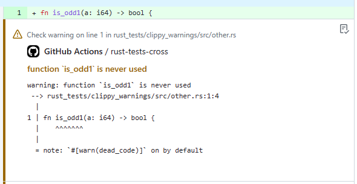

# `rs-clippy-check` Action

[](LICENSE)
[](https://github.com/clechasseur/rs-clippy-check/actions/workflows/ci.yml)

> Clippy lints in your Pull Requests

This GitHub Action executes [`clippy`](https://github.com/rust-lang/rust-clippy) and posts all lints as annotations for the pushed commit [<sup>1</sup>](#note-annotations-limit).



This GitHub Action has been forked from [actions-rs/clippy-check](https://github.com/actions-rs/clippy-check). The original project published under the name [`rust-clippy-check`](https://github.com/marketplace/actions/rust-clippy-check). See [LICENSE](LICENSE) for copyright attribution details.

## Example workflow

Note: this workflow uses [`actions-rust-lang/setup-rust-toolchain`](https://github.com/actions-rust-lang/setup-rust-toolchain) to install the most recent `nightly` clippy.

```yaml
name: Clippy check

on: push

jobs:
  clippy_check:
    runs-on: ubuntu-latest
    steps:
      - uses: actions/checkout@de0fac2e4500dabe0009e67214ff5f5447ce83dd # v6.0.2
      - uses: actions-rust-lang/setup-rust-toolchain@a0b538fa0b742a6aa35d6e2c169b4bd06d225a98 # v1.15.3
        with:
          toolchain: nightly
          components: clippy
      - uses: clechasseur/rs-clippy-check@v6.0.1
        with:
          args: --all-features
```

## Inputs

All inputs are optional.

| Name                | Required | Description                                                                                                                            | Type   | Default         |
| --------------------| :------: |----------------------------------------------------------------------------------------------------------------------------------------| ------ |-----------------|
| `toolchain`         |          | Rust toolchain name to use                                                                                                             | string |                 |
| `args`              |          | Arguments for the `cargo clippy` command                                                                                               | string |                 |
| `working-directory` |          | Directory where to perform the `cargo clippy` command                                                                                  | string |                 |
| `tool`              |          | Tool to use instead of `cargo` ([`cross`](https://github.com/cross-rs/cross) or [`cargo-hack`](https://github.com/taiki-e/cargo-hack)) | string |                 |
| `cache-key`         |          | Cache key when using a non-`cargo` `tool`                                                                                              | string | rs-clippy-check |

For extra details about the `toolchain`, `args`, `tool` and `cache-key` inputs, see [`rs-cargo` Action](https://github.com/clechasseur/rs-cargo#inputs).

## Release immutability

Starting with release 6.0.0, this GitHub action's releases will be marked as [immutable](https://docs.github.com/en/code-security/concepts/supply-chain-security/immutable-releases). This means that once a release is created, its tag cannot be modified in any way.

Previously, best practices for using GitHub actions in workflows were to pin the actions to a specific Git commit hash. With immutable releases, this is no longer necessary and the actual Git tag is safe to use. Because of this, starting with release 6.0.0, this GitHub action will **no longer provide a floating major version tag** (like `v6`, for example). To use a specific version of this action, pin it to the release tag (like `v6.0.0`).

## Notes

<a name="note-annotations-limit"><sup>1</sup></a> : Currently, GitHub sets a limit of 10 annotations of each type per run (see [this page](https://docs.github.com/en/rest/checks/runs?apiVersion=2022-11-28) for more information). So if there are more than 10 such lints of one type reported by `clippy`, only the first 10 will appear as PR annotations. The other lints will still appear in the check run summary (see [this one](https://github.com/clechasseur/rs-clippy-check/actions/runs/5921984365/attempts/1#summary-16055301757) for example).
